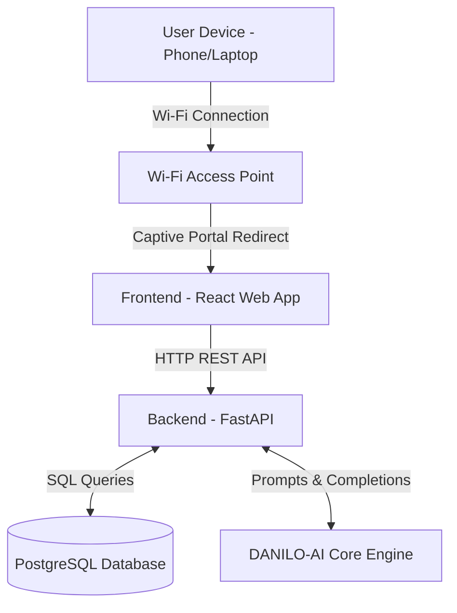

# Project DANILO

## Project Overview

**Project DANILO** is an offline-first, AI-powered Learning Management System (LMS) designed to revolutionize digital education in environments with limited or no internet connectivity. 

It was developed to bridge the digital divide by providing a robust, locally hosted platform where learning can happen anytime, anywhere. The system is built for **students, teachers, and school administrators**, providing them with modern digital tools typically found in cloud-based LMS platforms, but operating entirely offline. Its main purpose is to ensure that education remains uninterrupted, interactive, and AI-assisted regardless of external network availability.

---

## Key Features

* **Learning Management System (LMS)**: A comprehensive engine for managing courses, educational modules, and grading.
* **Student Portal**: A dedicated interface where students can view their enrolled classes, check grades, submit assignments, and study materials.
* **Teacher Portal**: A comprehensive dashboard for educators to manage classes, publish announcements, grade submissions, and view class insights.
* **Administrator Portal**: A central hub for school admins to manage the user directory, handle enrollments, generate reports, and monitor system health.
* **AI Features**: Includes an on-board AI Tutor for students to ask questions, and AI lesson generation and insights for teachers. All AI operations run locally without internet.
* **Analytics and Insights**: Provides teachers with AI-driven summaries of student performance, identifying strengths and weak concepts.
* **Offline Functionality**: The entire system—including the database, frontend interface, and AI models—runs on a local server or laptop.
* **Captive Portal System**: A built-in Wi-Fi hotspot system that automatically redirects users to the LMS the moment they connect their devices to the network.
* **Assessment Management**: Powerful tools for teachers to create, distribute, and grade quizzes and written assignments.
* **Class Management**: Streamlined administration of courses, subject areas, sections, and student enrollments.

---

## System Architecture

Project DANILO is built on a modern containerized architecture that separates the user interface, the server logic, the database, and the AI engine. When a user connects to the local Wi-Fi, the captive portal redirects them to the Frontend. The Frontend communicates with the Backend API, which in turn reads from the Database or queries the local AI System.



---

## Technology Stack

The system utilizes industry-standard tools to ensure high performance and reliability:

* **Programming Languages**: Python (Backend), JavaScript/JSX (Frontend), Bash/Shell (System Administration & Deployment), and HTML/CSS.
* **Frontend Technologies**: React, Vite, TailwindCSS (for styling), Zustand (for state management), and Framer Motion (for animations).
* **Backend Technologies**: Python, FastAPI, SQLAlchemy (for ORM), Alembic (for database migrations), and Pydantic.
* **Database**: PostgreSQL, accessed via the `psycopg` adapter.
* **AI Technologies**: Powered by **DANILO-AI**, our proprietary custom-tuned local AI model designed specifically for the educational context. It dynamically scales its capabilities based on the host hardware to ensure smooth offline performance.
* **Docker**: The entire stack is containerized using Docker and Docker Compose for easy deployment.
* **Networking Tools**: The system uses Linux networking tools like `hostapd` (to broadcast Wi-Fi), `dnsmasq` (for DNS and DHCP), and `iptables` (for routing traffic).

---

## Installation and Setup

### Prerequisites
* A Linux-based host machine (e.g., Ubuntu/Debian).
* A compatible Wi-Fi adapter capable of Access Point (AP) mode.
* Sufficient RAM and Storage (hardware dictates which AI model will be installed).

### Installation Steps
The project includes a powerful, automated setup script. To install the core system:
1. Clone the repository to your local machine.
2. Run the main installer script with root privileges:
   ```bash
   sudo bash danilo.sh --install
   ```

### Running the System
The system runs automatically as a `systemd` service (`danilo-stack.service`) and Docker Compose stack once installed. Connect to the broadcasted Wi-Fi network to access the portal.

### Production Deployment
For a full installation that includes pre-downloading heavy AI models for completely offline deployment, use:
```bash
sudo bash danilo.sh --full-install
```

---

## Folder Structure

Here is the primary folder structure of Project DANILO:

### `backend/`
**Purpose**: Contains all the server-side logic and database management.
**Contents**: Python files, FastAPI routes, database models, and AI integration scripts.
**Responsibilities**: Handling user authentication, processing LMS data, serving API requests, and managing the AI prompts.

### `frontend/`
**Purpose**: Contains the user interface of DANILO.
**Contents**: React components, routing logic, state management, and CSS styles.
**Responsibilities**: Rendering the Student, Teacher, and Admin portals, and handling all user interactions in the browser.

### `lib/`
**Purpose**: Contains the modular shell scripts used by the installer.
**Contents**: Scripts for Docker setup, networking, AI hardware detection, database setup, and system verification.
**Responsibilities**: Automating the complex setup of the captive portal, Wi-Fi hardware, and Docker containers.

### `models/`
**Purpose**: A dedicated directory for storing local AI models.
**Contents**: Compiled model weights and configurations for the DANILO-AI engine.
**Responsibilities**: Providing the offline intelligence required for the AI tutor and teacher insights.

---

## Important Files

### `danilo.sh`
**Purpose**: The master installation and management script.
**Role in the System**: It orchestrates the entire setup process, including dependency installation, hardware profiling, and service creation.
**Related Components**: Relies on the scripts inside the `lib/` directory.

### `backend/app/main.py`
**Purpose**: The entry point for the Backend API.
**Role in the System**: It initializes the FastAPI application, defines the security rules, handles database connections, and routes all incoming HTTP requests.
**Related Components**: Connects to the Database and the AI System.

### `backend/app/models.py`
**Purpose**: Defines the database schema.
**Role in the System**: It maps Python classes to PostgreSQL tables, detailing how users, courses, grades, and AI profiles are structured and related.
**Related Components**: Used by all backend route handlers to save and retrieve data.

### `frontend/src/App.jsx`
**Purpose**: The main routing component for the frontend web application.
**Role in the System**: It checks user authentication and directs the user to the correct portal (Student, Teacher, or Admin) based on their role.
**Related Components**: Connects all portal screens and layout components.

---

## Database Structure

The database is built on PostgreSQL and uses relational mapping to store all educational data securely. 

* **Users**: Stores accounts for Students, Teachers, and Admins, including their passwords, roles, and profiles.
* **Departments & Courses**: Organizes the school's curriculum. Departments contain Courses, which are assigned to Teachers.
* **Enrollments**: Links Students to the Courses they are taking.
* **Modules**: Stores the actual learning materials, lessons, and AI-generated content.
* **Assignments & Quizzes**: Stores the questions, instructions, and configurations for student assessments.
* **Submissions & GradeEntries**: Records student answers, grades, and teacher feedback.
* **AI Profiles & Chat Sessions**: Logs the interactions between students and the AI Tutor, maintaining a profile of student strengths and weaknesses.

---

## API Overview

The backend exposes a RESTful API organized into several main categories:

* **Authentication (`/auth`)**: Routes for logging in and generating secure access tokens.
* **Admin Routes (`/admin`)**: Used by administrators to manage users, courses, and system settings.
* **Teacher Routes (`/teacher`)**: Used by educators to upload materials, grade submissions, and view class analytics.
* **Student Routes (`/student`)**: Used by learners to access modules, submit assignments, and take quizzes.
* **AI Routes (`/ai`)**: Handles real-time chat sessions with the AI tutor and triggers background AI lesson generation.

The API relies on JSON format for all expected requests and responses.

---

## AI System

Project DANILO integrates its proprietary Artificial Intelligence, **DANILO-AI**, directly into the offline environment.

* **Integration**: The installer automatically profiles the host hardware (CPU, RAM, GPU) and scales the DANILO-AI engine to run optimally, ensuring smooth performance even on low-end school devices.
* **Teacher Features**: Teachers can upload raw documents (PDF, Word, Text) and the AI will automatically structure them into easily digestible lesson modules, complete with summaries, review questions, and objectives.
* **Student Features**: Students have access to a conversational AI Tutor that can explain complex concepts from their modules without giving away direct answers to quizzes.
* **Analytics**: The AI continuously analyzes student quiz scores and chat logs to build a "Student AI Profile," which highlights learning trends, strengths, and areas needing improvement.

---

## Captive Portal System

The Captive Portal is the bridge that connects physical devices to the offline software.

* **Connection**: The system uses the host machine's Wi-Fi adapter to broadcast a wireless network (Hotspot).
* **DNS & DHCP Flow**: When a user's phone or laptop connects, the system (`dnsmasq`) assigns them an IP address and intercepts all domain name requests.
* **Redirection Flow**: Regardless of what website the user tries to visit (e.g., google.com), the firewall rules (`iptables`) and DNS routing trick the device into loading the DANILO Login Page.
* **Offline Operation**: This creates a seamless "walled garden" where the LMS is highly accessible without requiring the user to type in specific IP addresses or have actual internet access.

---

## User Roles

### Students
Students are the primary consumers of the platform. They can view their daily schedule, read interactive lesson modules, submit file-based or written assignments, take timed quizzes, view their grades, and ask questions to the AI Tutor.

### Teachers
Teachers are the content creators and evaluators. They have the ability to create classes, upload educational materials, utilize AI to quickly generate structured lessons, grade student submissions, and view deep AI-generated insights regarding how well their class is understanding the topics.

### Administrators
Administrators are the system managers. They handle the onboarding of new users (creating student and teacher accounts), assigning teachers to departments, managing global enrollments, and viewing the technical health of the system (e.g., storage capacity, CPU usage).

---

## Security Features

* **Authentication**: All API endpoints are secured using JSON Web Tokens (JWT). Users must log in to receive a token.
* **Authorization**: Role-Based Access Control (RBAC) ensures that Students cannot access Teacher tools, and Teachers cannot access Admin settings.
* **Data Protection**: User passwords are securely hashed using `bcrypt` before being saved to the database.
* **Network Security**: Because the system operates primarily offline via a captive portal, it is inherently protected from external internet-based cyber threats.

---

## Deployment

Project DANILO is deployed via Docker containers, ensuring that the software runs identically regardless of the underlying Linux distribution.

* **Docker Containers**: The application is split into multiple containers: a database container, a backend container, a frontend web server, and the DANILO-AI core container.
* **Networking**: Docker handles internal networking between the database and the backend, while the host machine routes Wi-Fi traffic into the frontend container.
* **Production**: The installer automates the production deployment by handling environment variables, setting up automated backups, and configuring `systemd` to ensure the system boots automatically if the server loses power.

---

## Maintenance Guide

Maintaining Project DANILO is designed to be simple for IT staff:

* **Updating**: Run `sudo bash danilo.sh --update` to pull the latest codebase changes and rebuild only the necessary components without losing data.
* **Troubleshooting**: Administrators can view system logs directly from the Admin Portal or check the raw logs on the host server located in `/var/log/danilo`.
* **Backups**: The installer automatically configures daily database backups.
* **Monitoring**: The Admin Dashboard provides real-time metrics on server health, including Memory usage, AI availability, and storage space.

---

## Future Improvements

* **Cloud Synchronization**: Allowing the local offline instance to safely sync grades and enrollments with a central Cloud server when the device temporarily gains internet access.
* **Multi-Modal AI**: Upgrading the local AI to support image recognition, allowing students to upload pictures of their handwritten math problems for the AI tutor to analyze.
* **Clustered Deployments**: Supporting multi-router setups to expand the Wi-Fi range across an entire school campus while connecting back to a single DANILO server.

---

## Conclusion

Project DANILO represents a significant step forward in making modern, AI-enhanced education accessible to everyone, regardless of their geographical location or infrastructure limitations. By combining a beautiful interface, a robust local network architecture, and our custom DANILO-AI engine, it provides a comprehensive digital school environment that empowers teachers and enriches the learning experience for students—entirely offline.
